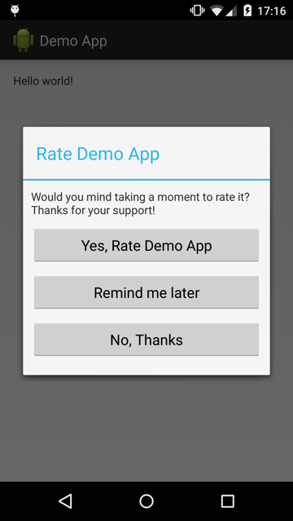

# RMP-Appirater

RMP-Appirater is an Android library that will help remind users to review your app on the Google play.



## Download

Gradle:

```groovy
compile 'jp.co.recruit_mp:android-RMP-Appirater:1.0.2'
```

## Usage

Simple

```java
public class MainActivity extends ActionBarActivity {
    @Override
    protected void onCreate(Bundle savedInstanceState) {
        super.onCreate(savedInstanceState);
        setContentView(R.layout.activity_main);

        // Show rating dialog if user isn't rating yet and don't select "Not show again".
        RmpAppirater.appLaunched(this);
    }
}
```

Custom

```java
public class MainActivity extends ActionBarActivity {
    @Override
    protected void onCreate(Bundle savedInstanceState) {
        super.onCreate(savedInstanceState);
        setContentView(R.layout.activity_main);

        // You can custom dialog texts and a showing rating dialog condition.
        RmpAppirater.appLaunched(this,
            new RmpAppirater.ShowRateDialogCondition() {
                  @Override
                  public boolean isShowRateDialog(
                      long appLaunchCount, long appThisVersionCodeLaunchCount,
                      long firstLaunchDate, int appVersionCode,
                      int previousAppVersionCode, Date rateClickDate,
                      Date reminderClickDate, boolean doNotShowAgain) {
                          // Show rating dialog if user isn't rating yet
                          // && don't select "Not show again"
                          // && launched app more than 5 times.
                          return (rateClickDate == null && !doNotShowAgain && appLaunchCount >= 5);
                }
            },
            new RmpAppirater.Options(
                "Custom title", "Custom message",
                "Custom rate button text", "Custom rate later button text",
                "Custom cancel button text"));
    }
}
```

## License

```
Copyright (C) 2015 Recruit Marketing Partners Co.,Ltd

Licensed under the Apache License, Version 2.0 (the "License");
you may not use this file except in compliance with the License.
You may obtain a copy of the License at

http://www.apache.org/licenses/LICENSE-2.0

Unless required by applicable law or agreed to in writing, software
distributed under the License is distributed on an "AS IS" BASIS,
WITHOUT WARRANTIES OR CONDITIONS OF ANY KIND, either express or implied.
See the License for the specific language governing permissions and
limitations under the License.
```

## Reference

- [appirater](https://github.com/arashpayan/appirater/)
- [appirater-android](https://github.com/drewjw81/appirater-android/)
